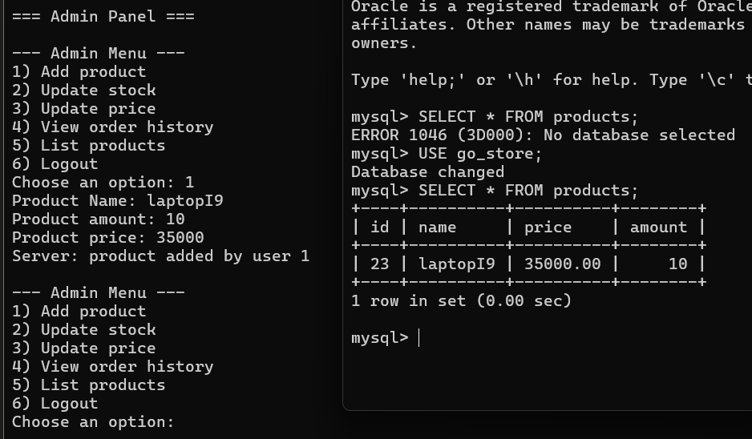
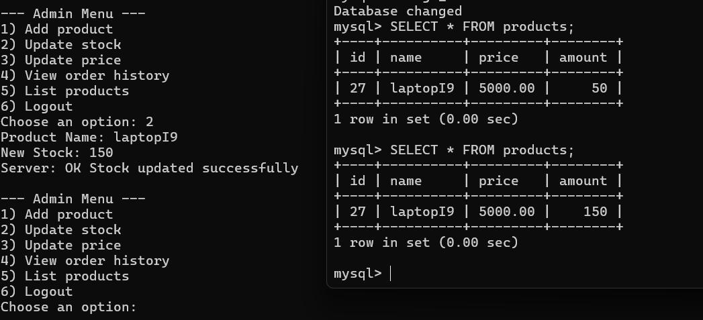
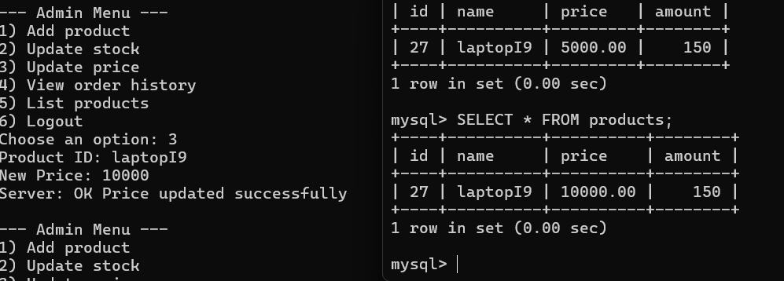
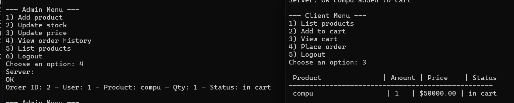
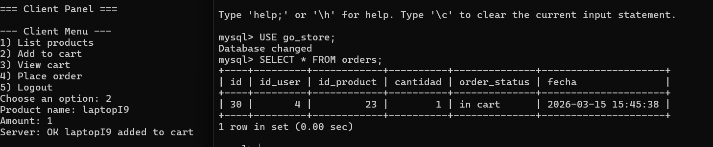
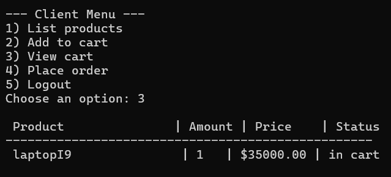
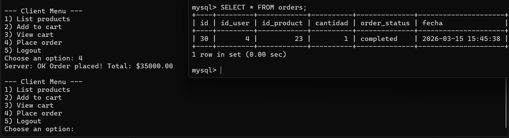

# Go Store

Proyecto simple en **Go + MySQL** para manejar:

* Usuarios
* Productos
* Órdenes

Este README explica cómo **instalar las dependencias y correr el proyecto localmente usando solo comandos**.

---

# 1. Requisitos

Instalar:

* Go
* MySQL Server
* Git

Verificar instalación:

```bash
go version
mysql --version
git --version
```

---

# 2. Instalar MySQL Server

## Windows

Instalar **MySQL Server** usando winget:

```bash
winget install Oracle.MySQL
```

Verificar instalación:

```bash
mysql --version
```
Posible problema 
En caso que la terminal no reconozca mysql tras ser instalado, debes poner la direccion del programa como una nueva variable del sistema en PATH.

Puedes acceder buscando en la barra de busqueda de Windows "Edit enviorment variables"

Iniciar el servicio:

```bash
net start MySQL
```

Si no funciona:

```bash
net start MySQL84
```

# 3. Clonar el repositorio

```bash
git clone https://github.com/jfong088/GoEcommerceSimulator.git
```

---

# 4. Crear las tablas con el schema
Se crea la base de datos en MySql

```bash
mysql -u root -p
```

```bash
CREATE DATABASE go_store;
```

```bash
exit
```

Desde la raíz del proyecto ejecutar:

```bash
mysql -u root -p go_store < src/server/database/schema.sql
```

Esto ejecutará automáticamente el archivo:

```
database/schema.sql
```
---

# 5. Instalar dependencias de Go
Meterse a la carpeta src/server

Instalar el driver de MySQL:

```bash
go get github.com/go-sql-driver/mysql
```

Limpiar dependencias:

```bash
go mod tidy
```

---

# 6. Configurar conexión a la base de datos

Editar el archivo:

```
database/connection.go
```

Configurar tus credenciales:

```go
user := "root"
password := "password"
host := "127.0.0.1"
port := "3306"
dbname := "go_store"
```

# Ejemplo de funcionalidades del administrador 
## Añadir producto

## Actualizar stock


## Actualizar precio


## Historial 



# Ejemplo de funcionalidades del cliente
## Añadir producto a carrito 

## Ver carrito

## Comprar productos en carrito



# Futuras mejoras 
1.- Busqueda de productos-> en vez de mostrar todos los productos disponibles, una mejora seria tambien poder buscar un producto en especifico

2.- Historial de compras-> que el cliente pueda ver sus compras pasadas con el dinero total que gasto, fecha, y el status del producto en completed 

3.- Bannear usuarios-> los admin puedan bloquear mails especificos o vaciarle el carrito a los clientes

# Extras
- Save status feature -> se utilizo una base de datos de sql para alamacenar usuarios, productos, ordenes, para que aunque se cierre el programa, podemos acceder de nuevo a los datos
- User registration -> gracias la base de datos, se pueden registrar y verificar usuarios para iniciar sesion
- Product blocking -> con uso de mutex, se logro hacer que la variable compartida de stock solo pueda ser accedida por 1 usuario a la vez
